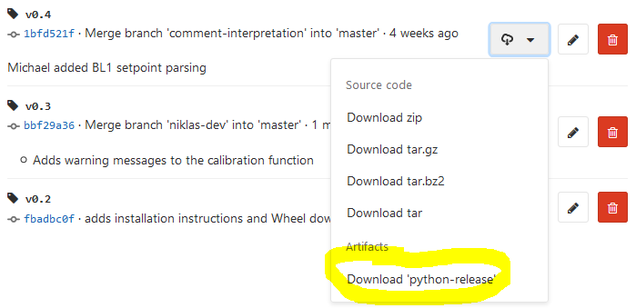

[](https://jugit.fz-juelich.de/IBG-1/micropro/bletl/commits/master)
[](https://jugit.fz-juelich.de/IBG-1/micropro/bletl/commits/master)

# Installation

## For Users
1. Got to [Repository/Tags](https://jugit.fz-juelich.de/IBG-1/biopro/bletl/tags) to view the
   list of releases & their release notes.
2. To download the Python wheel, click the _download_ button on the right and select `python-release`:



Unpack to `*.whl` file to somewhere and install it via pip. After that you can delete the `*.whl`.

```bash
pip install bletl-x.x-py3-none-any.whl
```

## For Developers
You can use `bletl` by installing it in your Python environment.
1. clone it `git clone https://jugit.fz-juelich.de/IBG-1/biopro/bletl`
2. `cd bletl`
3. `python setup.py develop` to install it into your (activated!) Python environment

# Contributing
The easiest way to contribute is to report bugs by opening [Issues](https://jugit.fz-juelich.de/IBG-1/biopro/bletl/issues).

If you want to contribute, you should...
1. clone `bletl`
2. create a new branch
3. make changes on your feature-branch
4. open a Merge Request

Also see the PowerPoint "BioProz Software Development" at `\\ibtfilesrv3\micropro\Anleitungen\Python`